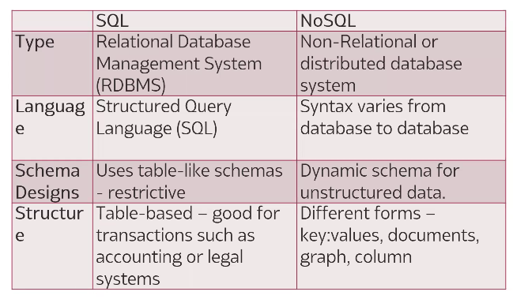
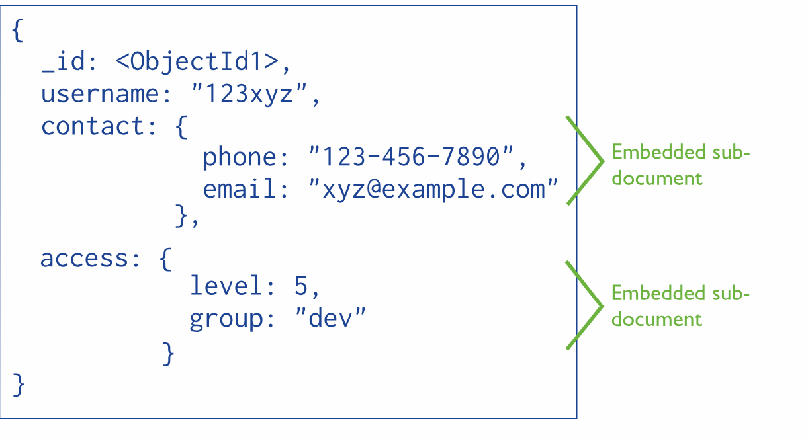

# **Mongodb**

MongoDB is a popular open source document database that’s widely used in modern web and mobile applications. It’s categorized as a NoSQL database, which means it takes a flexible, document-oriented approach to storing data rather than a traditional table-based relational method.

A big part of MongoDB’s appeal is its simplicity and developer focus. For example, Mongo interactions are defined by the acronym CRUD, for create, read, update, delete.

MongoDB saves data in JSON documents that make it relatively easy to use stored data—whether it’s structured, unstructured, or semistructured—for different kinds of applications. MongoDB’s flexible data model allows developers to store unstructured data while offering indexing support for faster file access and replication for data protection and availability. That means developers can design and build sophisticated applications using MongoDB.

# "embedding" vs "referencing"

# Installation (arch)

**yay -S mongodb80-bin**

permissions: sudo chown -R mongodb:mongodb /var/lib/mongodb

sudo systemctl enable mongodb

sudo systemctl start mongodb

**IDE GUI**

**yay -S mongodb-compass.git**

&nbsp;

**Interacting with database with CRUD principles -------->crud - create,read,update,delete**
