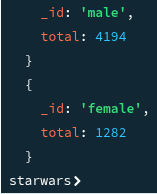
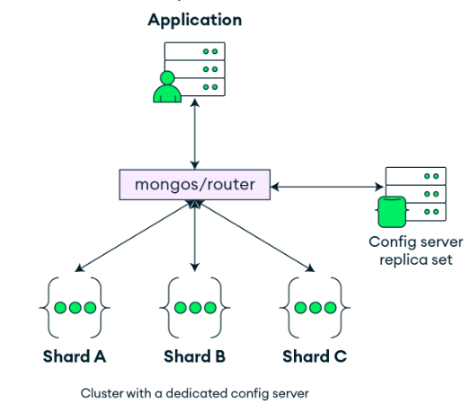
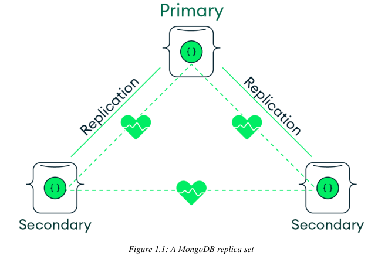

# mongodb compass

Interacting with starwars character data with mongo shell using compass

1.  use starwars  
    switched to db starwars
2.  db.characters.findOne({"name": "Luke Skywalker"})
3.  db.characters.findOne({"name":"Chewbacca"})
4.  Search for eyecolour of chewbacca(numbers on eyecolour correspond to binary to return :True/False)
5.  db.characters.findOne({"name":"Chewbacca"},{name:1,eye_color:1})
6.  db.characters.findOne({"name":"Chewbacca"},{name:true,eye_color:true,\_id:0})
7.  

&nbsp;

&nbsp;

# Query database using mongosh

1.  All female characters with blue eyes:  
    db.characters.find(  
    {  
    "eye_color": { \$in: \["yellow", "orange"\] }  
    },  
    {  
    "name": 1,  
    "eye_color": 1,  
    "\_id": 0  
    \`  
    )
    
2.  Similar but using \$or operator:  
    db.characters.find(  
    {  
    \$or: \[  
    { eye_color: "blue" },  
    { gender: "female" }  
    \]  
    },  
    {  
    name: 1,  
    eye_color: 1,  
    gender: 1,  
    \_id: 0  
    }  
    )
    
3.  turn "unknown" to null:  
    `db.characters.updateMany(``{height: "unknown"},``{$unset: {height: null}}`  
    `)`
    

# String values to integers

1.  find characters height above 200 using comparison operator \$gt(greater than) (here the integers are treated as strings)
2.  db.characters.find({height:{\$gt:200}})

**string values to integers:**

Converting string values to integers is relatively simple but "unknown" values of height will be tuned into "null" integers.

1.  Command below removed unknown heights as they were set to null
    
2.  db.characters.updateMany(  
      {height:"unknown"},  
      {\$unset:{height:null}}  
    )
    
3.  Command below converted valid heights to integers
    
4.  db.characters.updateMany(  
      {},  
      \[{\$set:{height:{\$toInt:"\$height"}}}\]  
    )
    
5.  search database to confirm changes to height
    
6.  db.characters.find({height:{\$gt:200}},{name:1,height:1,\_id:0})
    

**Challenge Until 14:15**

1.  Can you convert all mass values to ints? What to do with "unknown" mass values? null
    
2.  command below converts unknown mass to null values
    
3.  db.characters.updateMany(  
      {mass:"unknown"},  
      {\$unset:{mass:null}}  
    )
    
4.  Command below converted valid masses to integers
    
5.  Have to convert the mass for jabba on its own due to error using updateMany function due to the comma in its mass number
    
6.  db.characters.update( {mass:"1,358"}, {\$set:{mass:"1358"}} )
    
7.  db.characters.updateMany(  
      {mass:{\$exist:true}},  
      \[{\$set:{mass:{\$toDouble:"\$mass"}}}\]  
    )
    
8.  to search for changes
    
9.  db.characters.find({mass:{\$exists:true}},{name:1,mass:1,\_id:0}
    

2\. Change "mass" to "mass_kg"?

`db.characters.updateMany(`  
`{},`  
`{ $rename: { "mass": "mass_kg" } }`  
`)`

- Experiment with the following operators:
    
    &nbsp;
    
    | Operator | Meaning | Example |
    | --- | --- | --- |
    | \`\$eq\` | Equal to | \`{ age: { \$eq: 30 } }\` |
    | \`\$gt\` | Greater than | \`{ score: { \$gt: 90 } }\` |
    | \`\$gte\` | Greater than or equal | \`{ price: { \$gte: 100 } }\` |
    | \`\$in\` | In array | \`{ status: { \$in: \["A","B"\] } }\` |
    | \`\$lt\` | Less than | \`{ qty: { \$lt: 20 } }\` |
    | \`\$lte\` | Less than or equal | \`{ date: { \$lte: new Date() } }\` |
    | \`\$ne\` | Not equal | \`{ type: { \$ne: "admin" } }\` |
    
    &nbsp;
    

# Aggregation

Aggregation is is doing one logical operation then applying another operations using the results of the previous.

1.  db.characters.aggregate(\[

{\$match:{"species.name":"Human"}},  
{\$group:{\_id:null,total:{\$sum:"\$height"}}}

\])

2\. {\_id:null ---> this variables pools all the humans together in the group operator to their height can be totalled.

3\. to separate the height by gender need to have \_id: "\$gender"

4\. db.characters.aggregate(\[

{\$match:{"species.name":"Human"}},  
{\$group:{\_id: "\$gender",total:{\$sum:"\$height"}}}

\])

5.

6\. search for height of humans across homeworlds

7\. db.characters.aggregate(\[

{\$match:{"species.name":"Human"}},  
{\$group:{\_id: "\$homeworld.name",total:{\$sum:"\$height"}}}

\])

8\. db.characters.distinct("species.name")

9\. db.characters.count({"species.name":"Human"})

10\. db.characters.countDocuments({"species.name":"Human"})

11\. db.characters.countDocuments({})

# **Manual referencing**

**Darth vader**

1.  find object id reference number in characters collection
2.  db.characters.findOne({name:"Darth Vader"}, {\_id:1,name:1})
3.  replace the object Id for Darth vader in the starships collection by referencing the object ID from characters database.
4.  db.starships.insertOne({
    
    &nbsp; name: "TIE Advanced x1",
    
    &nbsp; model: "Twin Ion Engine Advanced x1",
    
    &nbsp; manufacturer: "Sienar Fleet Systems",
    
    &nbsp; length: 9.2,
    
    &nbsp; max_atmosphering_speed: 1200,
    
    &nbsp; crew: 1,
    
    &nbsp; passengers: 0,
    
    &nbsp; pilot: ObjectId("699442e9c4453eddc2b4f284")
    
    })
    

# **Replica sets in MongoDB**

- A replica set is a group of MongoDB servers that all maintain the same dataset. One node is the primary, and the others are secondaries. The primary handles all writes; secondaries replicate the data from the primary.
    
- Why replica sets matter
    
    - **High availability**  
        If the primary fails, the cluster keeps running.
    - **Data redundancy**  
        Multiple copies of your data exist across different machines.
    - **Automatic failover**  
        No manual intervention needed when a node dies.
    - **Read scaling**  
        You can send read queries to secondaries (if your app allows eventual consistency).

# **Sharding in MongoDB**

****

**Sharding splits a large dataset into smaller, more manageable pieces called shards, each stored on different servers. Instead of one machine doing all the work, multiple machines share the load.**

MongoDB uses a **sharded cluster**, which has three main components:

- **Shards** – store the actual data (each shard is usually a replica set)
- **Config servers** – store metadata about the cluster (what data lives where)
- **Mongos routers** – the entry point for applications; they route queries to the correct shard

Why sharding matters

- Handles **very large datasets** (terabytes to petabytes)
- Supports **high throughput** for read/write operations
- Allows **linear scaling** by adding more shards
- Prevents a single server from becoming a bottleneck

&nbsp;

| Component | Purpose |
| --- | --- |
| \*\*Shard\*\* | Stores data; usually implemented as a replica set |
| \*\*Config Server (CSRS)\*\* | Holds metadata and cluster configuration |
| \*\*Mongos Router\*\* | Routes client queries to the appropriate shard |

&nbsp;
